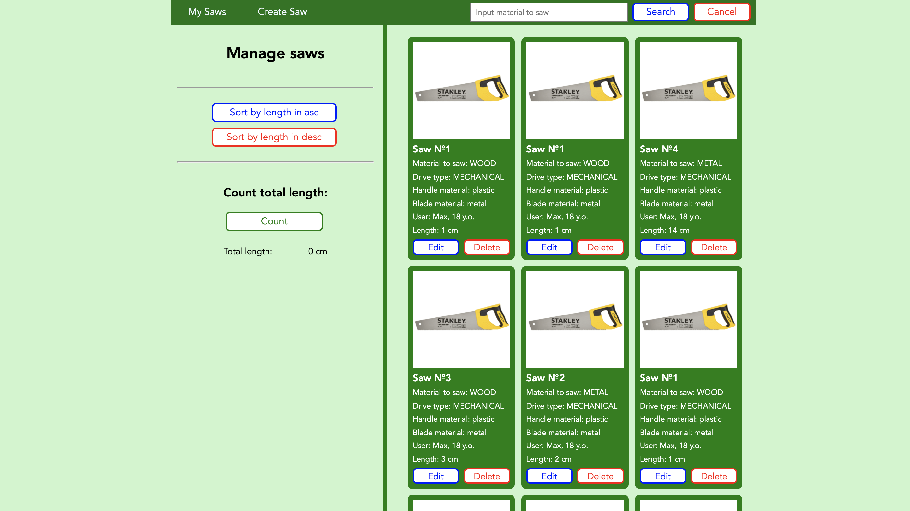

# Lab №3. CRUD Javascript App: View Page

## <b>Description:</b> Description: In this work, you have to make a simple presentation part of a website - View Page.

## <b>Requirements:</b>

- For your blocks you must use data from your java/python project class.
- Then using JavaScript, you need to implement the following operations on your data (it is up to you to decide which field should be used for each of the operations):

  1. Sort of your items option
  2. Search option
  3. Count total amount of some of the field

- Responsiveness is absolutely not required.
- Styling is not important at all. Is up to you.

---

## Design template

https://wireframepro.mockflow.com/view/lviv-iot-crud-js-app

---

## Installation

1. Clone repo to any folder you want
2. Open index.html in you browser
